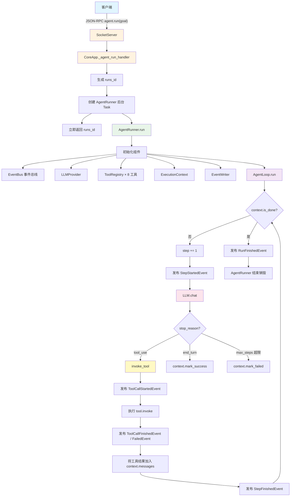
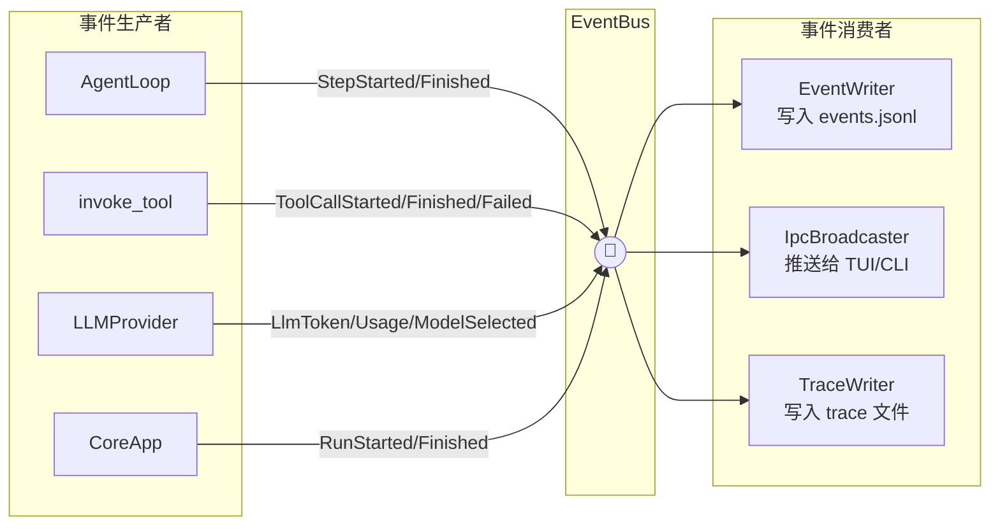

# CrispCode Core 架构

## 极简文字流程

```
用户提问 (CLI / TUI)
    │
    │  JSON-RPC over TCP
    ▼
SocketServer (一直运行，等待连接)
    │
    │  解析 agent.run 命令
    ▼
CoreApp._agent_run_handler()
    │
    ├─ 生成 runs_id
    ├─ 创建 AgentRunner（后台 asyncio.Task）
    └─ 立即返回 runs_id 给客户端
            │
            ▼
      AgentRunner.run(goal, runs_id)
            │
            ├─ 创建 EventBus（事件总线）
            ├─ 创建 LLMProvider（Anthropic / OpenAI）
            ├─ 创建 ToolRegistry（8 个内置工具）
            ├─ 创建 ExecutionContext（会话上下文）
            ├─ 创建 EventWriter（事件持久化）
            │
            └─ 启动 AgentLoop.run(context)
                   │
                   ┌──────────────────────────────────────┐
                   │  while not context.is_done():        │
                   │      1. context.step += 1             │
                   │      2. 发布 StepStartedEvent        │
                   │      3. 调用 LLM.chat()              │
                   │         ├─ text → 追加 assistant 消息 │
                   │         └─ tool_use → 调用工具        │
                   │      4. invoke_tool() 执行工具        │
                   │         ├─ 成功 → ToolFinishedEvent   │
                   │         └─ 失败 → ToolFailedEvent     │
                   │      5. 将工具结果加入 context        │
                   │      6. 发布 StepFinishedEvent       │
                   │                                       │
                   │  退出条件:                            │
                   │      - stop_reason == "end_turn"      │
                   │      - step >= max_steps              │
                   │      - 异常 / 取消                    │
                   └──────────────────────────────────────┘
```

## 一句话总结

> 一次问答 = 一次 `agent.run` = 一个临时的 `AgentRunner` = 一个 `AgentLoop` 的多步循环 = 多次 LLM 调用 + 工具调用。跑完即销毁。

---

## 流程图 (Mermaid)



---

## 常驻 vs 临时组件

| 组件 | 生命周期 | 说明 |
|------|----------|------|
| **SocketServer** | 常驻 | `await reader.readline()` 循环，等待客户端命令 |
| **CoreApp** | 常驻 | `await shutdown.wait()`，等待 SIGINT/SIGTERM |
| **TraceWriter** | 常驻 | `await queue.get()` 循环，等待写入 trace 记录 |
| **IpcEventBroadcaster** | 常驻 | 转发事件给已订阅的客户端连接 |
| **AgentRunner** | 临时 | 每次 `agent.run` 创建一个，跑完即销毁 |
| **AgentLoop** | 临时 | 跟着 AgentRunner 一起生、一起死 |
| **invoke_tool()** | 临时 | 工具调用时创建，返回结果即结束 |

---

## 核心模块一览

```
core/
├── app.py           # CoreApp — daemon 入口，注册命令 handler，管理生命周期
├── config.py        # CrispConfig — 配置加载（host/port/llm/trace/agent）
├── context.py       # ExecutionContext — 单次 run 的会话上下文（消息、状态、step）
├── runner.py        # AgentRunner — 一次 run 的编排器，组装所有组件并启动 AgentLoop
├── loop.py          # AgentLoop — 多步对话循环（LLM ↔ 工具 交替执行）
├── logging.py       # 日志初始化
├── runs.py          # runs 目录 / ID 生成工具
│
├── bus/             # 命令与事件定义
│   ├── commands.py  #   PingCommand, AgentRunCommand, EventSubscribeCommand
│   ├── envelope.py  #   JsonRpcRequest/Response, EventPushEnvelope
│   └── events.py    #   Run/Step/Tool/LLM 等事件类型
│
├── events/          # 事件基础设施
│   ├── bus.py       #   EventBus — 简单发布/订阅
│   └── writer.py    #   EventWriter — 事件写入 JSONL 文件
│
├── llm/             # LLM 集成
│   ├── provider.py  #   AnthropicProvider / OpenAIProvider
│   ├── formatters.py#   消息格式转换（Anthropic ↔ OpenAI）
│   └── types.py     #   LlmResponse, ToolCallBlock 等类型
│
├── tools/           # 工具系统
│   ├── base.py      #   Tool 抽象基类, ToolResult
│   ├── registry.py  #   ToolRegistry — 注册/查找工具
│   ├── invocation.py#   invoke_tool() — 校验/调用/超时/事件发布
│   └── builtin/     #   8 个内置工具
│       ├── bash.py
│       ├── read_file.py
│       ├── write_file.py
│       ├── list_dir.py
│       ├── task_create.py
│       ├── task_update.py
│       ├── task_list.py
│       └── task_get.py
│
├── transport/       # 通信层
│   ├── socket_server.py    # TCP JSON-RPC 服务器
│   ├── socket_client.py    # TCP 客户端
│   └── ipc_broadcaster.py  # 事件推送给已订阅客户端
│
└── trace/           # 调试追踪
    ├── record.py    #   TraceRecord 数据模型
    ├── writer.py    #   TraceWriter — 异步写入 trace 文件
    └── provider.py  #   TracingProvider — 包装 LLMProvider，记录请求/响应
```

---

## 事件总线流向



---

## 类比理解

| 角色 | 对应组件 | 行为 |
|------|----------|------|
| 前台接待 | SocketServer | 一直值班，有客人来才带路 |
| 经理 | CoreApp | 等下班信号（SIGINT） |
| 记录员 | TraceWriter | 等要记录的东西 |
| 广播站 | IpcEventBroadcaster | 有订阅者才广播 |
| **临时项目组** | **AgentRunner** | 来了任务才组建，做完就解散 |
| **每日站会** | **AgentLoop** | 项目期间反复开，项目结束就停 |
| 一次电话 | invoke_tool() | 打完就挂 |
